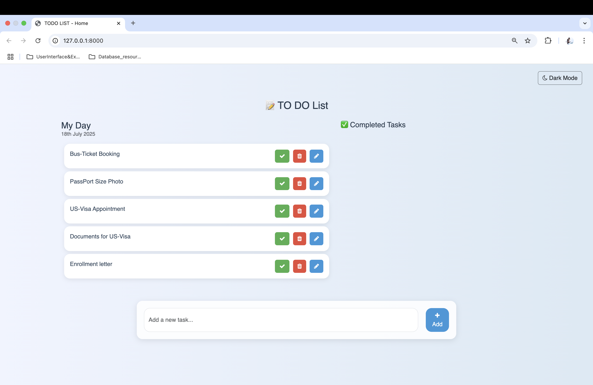
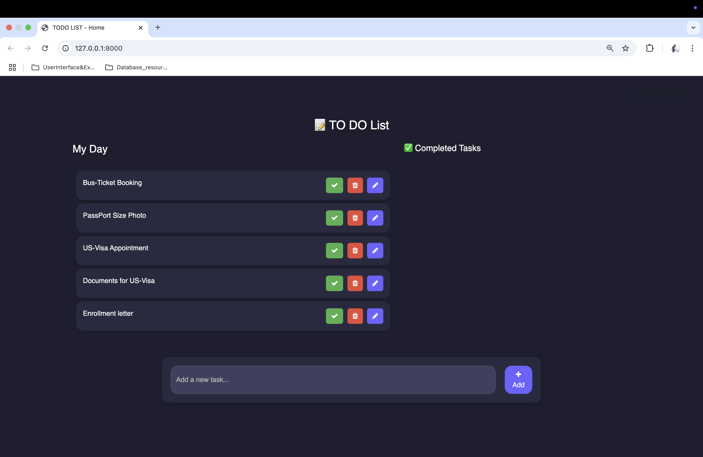

<!DOCTYPE html>
<html lang="en">
<head>
  <meta charset="UTF-8">
  <title>📝 Django To-Do List</title>
  <link rel="stylesheet" href="https://cdn.jsdelivr.net/npm/bootstrap@5.3.0/dist/css/bootstrap.min.css">
  
</head>
<body>

  

    <h1 class="mb-4">📝 Django To-Do List App</h1>

    
This is a clean and minimal To-Do List application built with <strong>Django</strong> and styled using <strong>Bootstrap 5</strong>. It supports task creation, editing, deletion, completion toggling, and includes a <strong>dark mode toggle</strong>.

    <h2>🚀 Features</h2>
    <ul>
      <li>Add, edit, and delete tasks</li>
      <li>Mark tasks as done or undone</li>
      <li>Separate views for <strong>Today’s tasks</strong> and <strong>Completed tasks</strong></li>
      <li>Responsive UI with Bootstrap cards</li>
      <li>New Dark mode toggle with persistent state</li>
    </ul>

    <h2>📸 Screenshots</h2>
    
(Replace with your actual screenshots)

    
    

    <h2>🔧 Setup Instructions</h2>
    <ol>
      <li>Clone the repository: <code>git clone https://github.com/yourusername/django-todo.git</code></li>
      <li>Create a virtual environment: <code>python -m venv env</code></li>
      <li>Activate the environment: 
        <code>source env/bin/activate</code> (Mac/Linux) 
        <code>env\Scripts\activate</code> (Windows)
      </li>
      <li>Install dependencies: <code>pip install -r requirements.txt</code></li>
      <li>Run migrations: <code>python manage.py migrate</code></li>
      <li>Start the development server: <code>python manage.py runserver</code></li>
      <li>Visit: <code>http://127.0.0.1:8000/</code></li>
    </ol>

    <h2>🛠️ Tech Stack</h2>
    <ul>
      <li><strong>Backend:</strong> Django (Python)</li>
      <li><strong>Frontend:</strong> HTML, CSS, Bootstrap 5, Font Awesome</li>
      <li><strong>Other:</strong> JavaScript (theme toggle)</li>
    </ul>

    <h2>🌗 Dark Mode</h2>
    
Includes a built-in toggle (🌙 / ☀️) that saves user preference with <code>localStorage</code>. Theme works across multiple pages with a shared JS file.

    <h2>📂 Directory Structure</h2>
    <pre>
/myproject/
├── myapp/
│   ├── templates/
│   │   └── home.html
│   ├── static/
│   │   └── js/theme.js
│   └── views.py
├── static/
│   └── js/theme.js
├── manage.py
├── db.sqlite3
    </pre>

    <h2>📜 License</h2>
    
This project is open-source and free to use under the MIT License.

  

</body>
</html>
